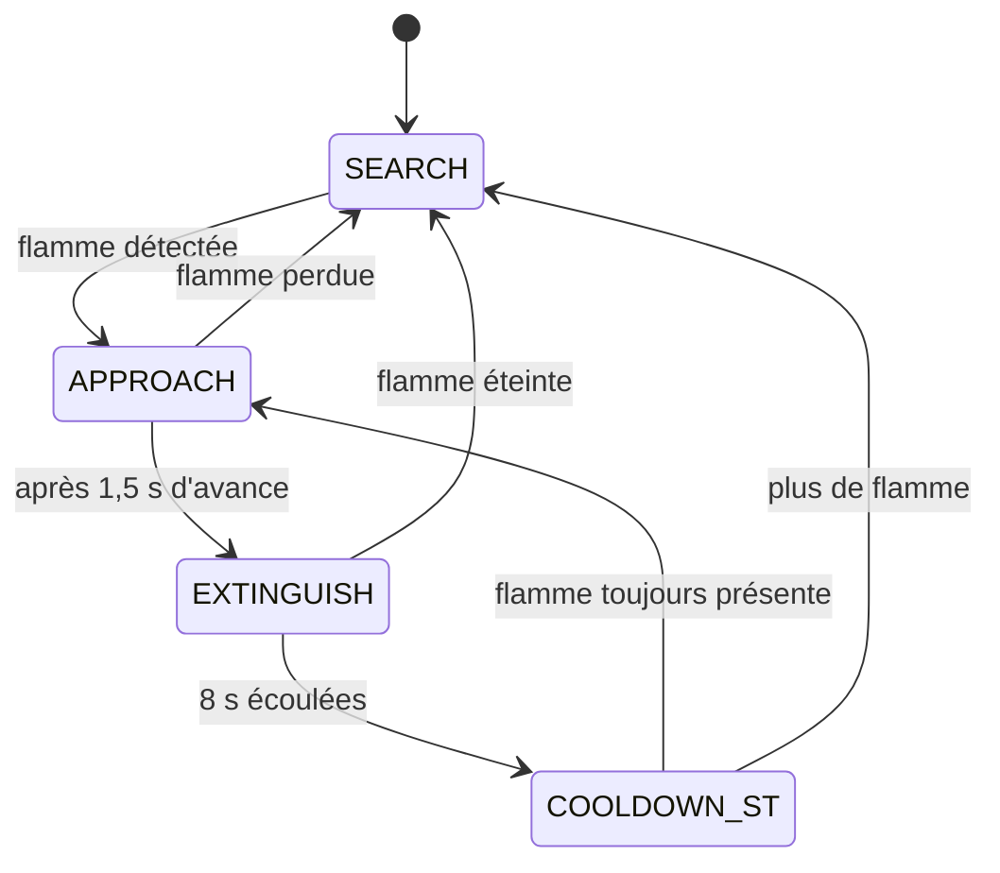

# Robot anti-incendie autonome (Arduino)

Robot mobile autonome qui **cherche une flamme, s'en approche et l'éteint avec une pompe à eau**. Le comportement est géré par une machine à états non bloquante, avec un seul capteur de flamme.

> Projet réalisé avec Arduino Uno, un driver moteur L298N, un module relais, un servomoteur et un capteur de flamme infrarouge.

---

## Fonctionnalités

- Recherche de flamme par **pivot sur place** (rotation par petits pas)
- Approche automatique de la flamme
- Extinction par **pompe à eau** commandée par relais, avec **lance orientable** (balayage du servo)
- **Sécurités** : durée d'arrosage limitée (8 s) puis pause (5 s), pompe coupée au démarrage
- **Filtre anti-parasites** sur la lecture du capteur (4 lectures positives sur 5)
- Code **non bloquant** (`millis()`) : le robot reste réactif en permanence

---

## Matériel

| Composant | Rôle |
|---|---|
| Arduino Uno | Cerveau du robot |
| Capteur de flamme IR (sortie numérique D0) | Détection de la flamme |
| Driver moteur L298N | Pilotage des moteurs (sens + vitesse PWM) |
| 2 ou 4 moteurs DC avec roues | Déplacement (direction différentielle) |
| Module relais 5 V | Commande de la pompe |
| Mini pompe à eau + tuyau + réservoir | Extinction |
| Servomoteur (SG90 ou équivalent) | Orientation de la lance |
| Batterie 7 à 12 V | Alimentation de puissance |
| Diode 1N4007 | Protection du relais (sur la pompe) |
| Châssis, fils, plaque d'essai | Montage |

---

## Câblage

### Capteur de flamme

| Capteur | Arduino |
|---|---|
| VCC | 5V |
| GND | GND |
| OUT (D0) | **D8** |

### Driver moteur L298N

| L298N | Branché sur |
|---|---|
| IN1 | D2 |
| IN2 | D4 |
| ENA | D3 (PWM) |
| IN3 | A0 |
| IN4 | A1 |
| ENB | D5 (PWM) |
| OUT1 / OUT2 | Moteur(s) gauche |
| OUT3 / OUT4 | Moteur(s) droit |
| 12V | Batterie + |
| GND | GND commun (batterie − et Arduino) |

> Retirer les jumpers **ENA** et **ENB** pour que le PWM fonctionne. Garder le jumper du régulateur 5 V.
> Avec 4 roues, brancher les deux moteurs d'un même côté **en parallèle** sur la même paire de sorties.

### Module relais et pompe

| Relais | Branché sur |
|---|---|
| IN | D10 |
| VCC | 5V |
| GND | GND |
| COM | Batterie + |
| NO | Pompe + |

Le **−** de la pompe va directement au **−** de la batterie. Placer une diode **1N4007** en parallèle sur la pompe (bande côté +).

### Servomoteur

| Servo | Branché sur |
|---|---|
| Signal | D9 |
| Rouge (+) | Borne 5V du L298N |
| Marron / noir (−) | GND commun |

### Masse commune

Tous les GND (batterie, L298N, Arduino, relais, capteur, servo, pompe) doivent être reliés ensemble.

---

## Fonctionnement

Le robot est une **machine à états** à 4 états :

| État | Action |
|---|---|
| `SEARCH` | Pivote par pas de 120 ms avec pauses de 500 ms pour laisser le capteur « regarder » |
| `APPROACH` | La flamme est devant : le robot avance pendant 1,5 s |
| `EXTINGUISH` | Moteurs arrêtés, pompe active, servo qui balaie entre 60° et 120° |
| `COOLDOWN_ST` | Pompe coupée pendant 5 s pour protéger le matériel |

Comme il n'y a qu'un capteur, **le robot s'oriente avec son propre corps** : il tourne jusqu'à voir la flamme, qui est alors forcément devant lui.

---

## Réglages

Les paramètres se trouvent en haut du fichier :

| Constante | Valeur | Rôle |
|---|---|---|
| `FLAME_DETECTED` | `HIGH` | Niveau de sortie du capteur quand il voit une flamme (`LOW` sur certains modules) |
| `RELAY_ACTIVE_LOW` | `true` | `false` si la pompe démarre à l'envers |
| `SPEED` | `200` | Vitesse des moteurs (0 à 255) |
| `SEARCH_TURN` | `120` ms | Durée d'un pas de rotation |
| `SEARCH_PAUSE` | `500` ms | Pause entre deux pas |
| `APPROACH_MS` | `1500` ms | Durée d'avance vers la flamme |
| `MAX_SPRAY` | `8000` ms | Arrosage maximum d'affilée |
| `COOLDOWN_MS` | `5000` ms | Pause de sécurité |
| `SWEEP_MIN` / `SWEEP_MAX` | `60` / `120` | Angles du balayage de la lance |

---

## Tests et calibration

Avant le premier essai complet :

1. **Capteur** : lire les valeurs avec le moniteur série (sans flamme, puis avec une flamme) pour confirmer `FLAME_DETECTED`.
2. **Moteurs** : roues en l'air, vérifier que les deux côtés tournent dans le bon sens.
3. **Pivot** : poser le robot au sol, il doit tourner **sur place** (par à-coups) sans avancer.
4. **Pompe** : tester à vide ou avec un petit récipient, loin de l'électronique.
5. **Capteur de flamme** : régler le potentiomètre du module pour une détection à environ 30-50 cm.

---

## Problèmes rencontrés et solutions

| Problème | Cause | Solution |
|---|---|---|
| Le robot tournait sans jamais s'arrêter | Logique du capteur inversée (`LOW` au lieu de `HIGH`) | Constante `FLAME_DETECTED` réglable |
| Le robot ne s'approchait jamais de la flamme | Première version : orientation sans phase d'avance | Ajout de l'état `APPROACH` avec avance temporisée |
| Robot bloqué pendant l'arrosage | `delay()` bloquant | Passage à `millis()` et à une machine à états |
| Risque de griller l'Arduino | Pompe branchée sur une broche (≈ 20 mA max) | Relais avec alimentation séparée |
| Pivot difficile à 4 roues | Frottement au sol | Vitesse plus élevée, pas de rotation plus long |

---

## Limites

- Pas de **mesure de distance** : l'avance dure un temps fixe.
- Recherche plus lente et moins précise qu'avec plusieurs capteurs.
- Capteur sensible à la **lumière du soleil** et aux lampes (usage intérieur recommandé).
- Pas d'**évitement d'obstacles**.
- Autonomie limitée par la batterie et le réservoir.

---

## Améliorations possibles

- Capteur **ultrason** (HC-SR04) pour mesurer la distance et éviter les obstacles
- Capteur de flamme **analogique** pour estimer l'intensité de la flamme
- Capteur de **fumée / température** (MQ-2, DHT22) pour confirmer l'incendie
- Passage sur **ESP32** avec alerte Wi-Fi (Telegram, e-mail)
- **Encodeurs** sur les roues pour contrôler la rotation et la distance
- **Bouton d'arrêt d'urgence** coupant moteurs et pompe
- Version à **2 ou 3 capteurs** pour une orientation directe vers la flamme

---

## Sécurité

- Toujours tester avec une **petite flamme** (bougie), dans un endroit dégagé, avec un **extincteur** à portée.
- Ne jamais laisser le robot fonctionner sans surveillance.
- Garder l'eau à l'écart de l'électronique et vérifier l'absence de court-circuit avant de brancher la batterie.

---

Samira Oulhi
